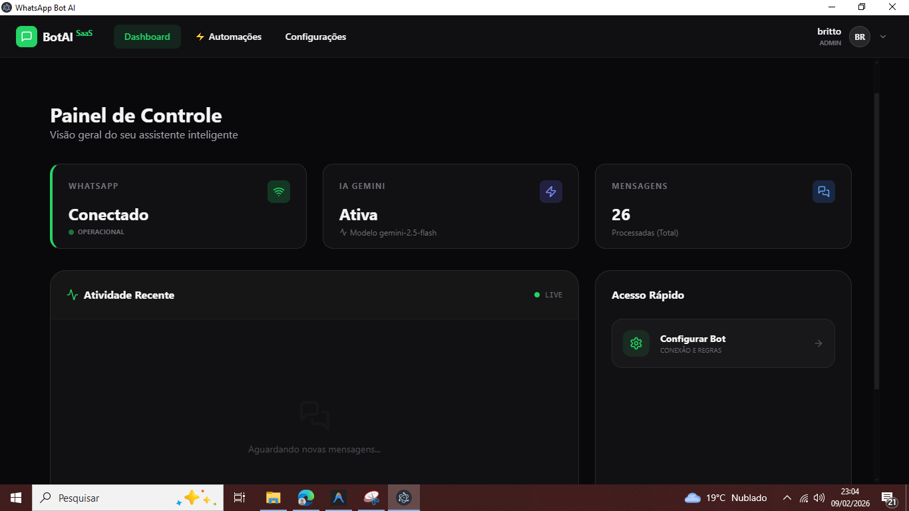
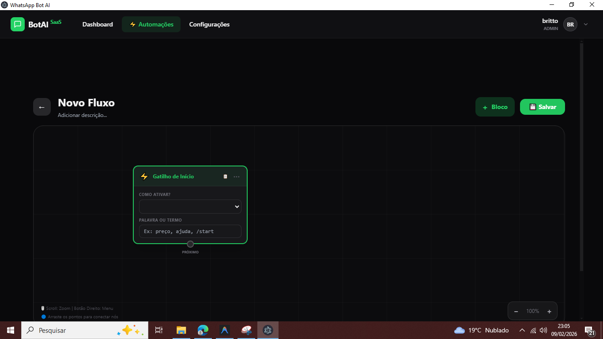
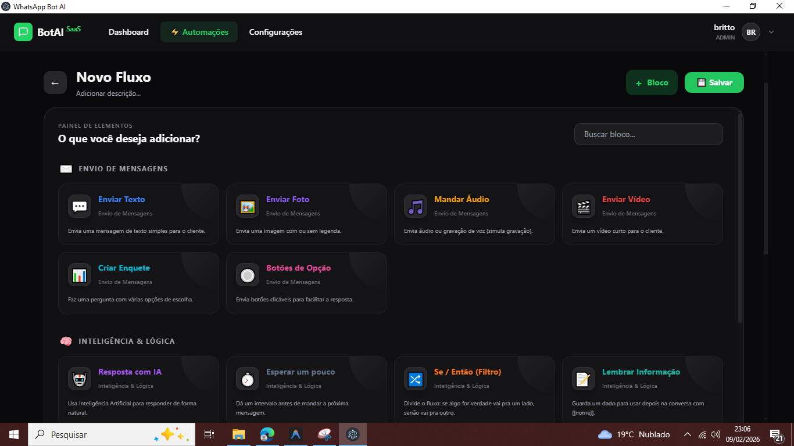

# 🤖 BotAI - WhatsApp Bot Inteligente & Visual

O **BotAI** é uma plataforma robusta de automação para WhatsApp que combina o poder da Inteligência Artificial (Gemini) com um construtor de fluxos visual (Visual Flow Builder). Projetado para ser intuitivo para usuários não técnicos e flexível para desenvolvedores.



## 🌟 Principais Funcionalidades

- **Visual Flow Builder**: Crie fluxos de conversa complexos arrastando e soltando blocos.
- **Inteligência Artificial**: Integração nativa com o Google Gemini para respostas naturais e contextuais.
- **Conexão QR Code**: Gerenciamento simples da conexão com o WhatsApp via terminal ou interface.
- **Extração de Dados**: Extraia informações de mensagens e armazene em variáveis para usar no fluxo.
- **Gatilhos Flexíveis**: Responda a palavras-chave, expressões regulares ou eventos específicos.
- **Dashboard em Tempo Real**: Visualize estatísticas de mensagens processadas e status da conexão.
- **Filtros e Lógica**: Use blocos de condição (Se/Então) para criar caminhos personalizados no seu fluxo.



## 🚀 Como Começar

### Pré-requisitos

- [Node.js](https://nodejs.org/) (Recomendado v18+) ou [Bun](https://bun.sh/)
- Uma chave de API do [Google Gemini](https://aistudio.google.com/)

### Instalação

1. Clone o repositório:
   ```bash
   git clone https://github.com/Matheusbritto77/WBot.git
   cd WBot
   ```

2. Instale as dependências:
   ```bash
   bun install
   # ou
   npm install
   ```

3. Configure suas credenciais na aba de **Configurações** dentro do aplicativo após iniciar.

### Executando em Desenvolvimento

```bash
bun run dev
# ou
npm run dev
```

### Gerando o Executável

```bash
bun run build:win
# ou
npm run build:win
```

## 🛠️ Tecnologias Utilizadas

- **Frontend**: SolidJS, Tailwind CSS, Kobalte UI.
- **Backend/Desktop**: Electron, Fastify, Better-SQLite3.
- **Integrações**: Baileys (WhatsApp API), Google Generative AI (Gemini).
- **Estilização**: Design Premium com Grid Dinâmica e Efeitos de Glassmorphism.


## 📋 Como usar o Builder

1. Vá para a aba **Automações**.
2. Clique em **+ Novo Fluxo**.
3. Adicione um **Gatilho de Início**.
4. Conecte blocos de **Enviar Texto**, **Resposta com IA** ou **Condição**.
5. Salve e ative seu fluxo.



---
Desenvolvido com ❤️ por [Matheusbritto77](https://github.com/Matheusbritto77)
